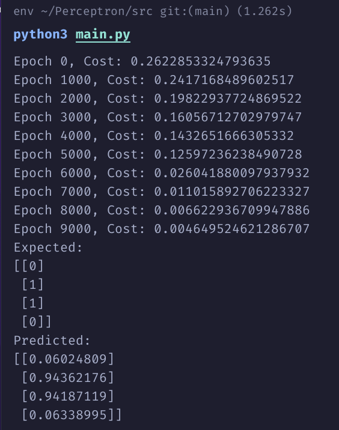

# Perceptron

Este repositório contém a implementação de um Perceptron Multicamadas (MLP) para resolver o problema do XOR.

## Instalação

Clone o repositório e instale as dependências necessárias (neste caso, apenas `numpy`):

```sh
git clone git@github.com:Eduardo-Barreto/Perceptron.git
cd Perceptron/src
pip install -r requirements.txt
```

## Uso

Para rodar, basta executar o script `main.py` dentro de `src/`:

```sh
python main.py
```

# Demonstração


